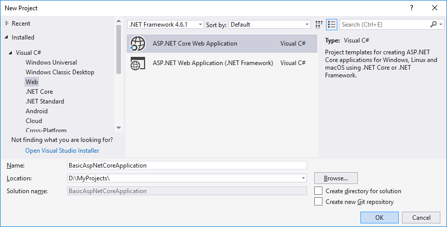

## Getting Started ABP With AspNet Core MVC Web Application

### Create A New Project

1. Create a new empty AspNet Core Web Application from Visual Studio:



2. Select Empty Template


You could select another template, but I want to show it from a clear project.

### Install Volo.Abp.AspNetCore.Mvc Package

Volo.Abp.AspNetCore.Mvc is AspNet Core MVC integration package for ABP. So, install it to your project:

````
Install-Package Volo.Abp.AspNetCore.Mvc
````

### Create First ABP Module

ABP is a modular framework and it requires a **startup (root) module** class derived from ``AbpModule``:

````C#
using Microsoft.AspNetCore.Builder;
using Microsoft.AspNetCore.Hosting;
using Microsoft.Extensions.DependencyInjection;
using Volo.Abp;
using Volo.Abp.AspNetCore.Modularity;
using Volo.Abp.AspNetCore.Mvc;
using Volo.Abp.Modularity;

namespace BasicAspNetCoreApplication
{
    [DependsOn(typeof(AbpAspNetCoreMvcModule))]
    public class AppModule : AbpModule
    {
        public override void ConfigureServices(IServiceCollection services)
        {
            services.AddMvc();

            services.AddAssemblyOf<AppModule>();
        }

        public override void OnApplicationInitialization(ApplicationInitializationContext context)
        {
            var app = context.GetApplicationBuilder();
            var env = context.GetEnvironment();

            if (env.IsDevelopment())
            {
                app.UseDeveloperExceptionPage();
            }

            app.UseMvcWithDefaultRoute();
        }
    }
}
````

``AppModule`` is a good name for the startup module for an application.

A module class can register services to Dependency Injection by overriding ``ConfigureServices`` method as shown here. ``AddAssemblyOf<...>`` is a special extension method of ABP that registers all services in an assembly by convention (TODO: link to DI document). While this is optional, a module generally registers some services.

ABP packages define module classes and a module can depend on another module. In the code above, our ``AppModule`` depends on ``AbpAspNetCoreMvcModule`` (defined by Volo.Abp.AspNetCore.Mvc package). It's common to add a ``DependsOn`` attribute after installing a new ABP nuget package.

Instead of Startup class, we are registering dependencies and configuring AspNet Core pipeline in this module class.

### The Startup Class

Next step is to modify Startup class to integrate to ABP module system:

````C#
using System;
using Microsoft.AspNetCore.Builder;
using Microsoft.Extensions.DependencyInjection;

namespace BasicAspNetCoreApplication
{
    public class Startup
    {
        public IServiceProvider ConfigureServices(IServiceCollection services)
        {
            services.AddApplication<AppModule>();

            return services.BuildServiceProviderFromFactory();
        }

        public void Configure(IApplicationBuilder app)
        {
            app.InitializeApplication();
        }
    }
}

````

Changed ``ConfigureServices`` method to return ``IServiceProvider`` instead of ``void``. This change allows us to replace AspNet Core's Dependency Injection with another framework (see Autofac integration section below). ``services.AddApplication<AppModule>()`` adds all services defined in all modules beginning from the ``AppModule``.

``app.InitializeApplication()`` call in ``Configure`` method initializes and starts the application.

### Hello World!

The application above does nothing. Let's create an MVC controller does something:

````C#
using Microsoft.AspNetCore.Mvc;
using Volo.Abp.AspNetCore.Mvc;

namespace BasicAspNetCoreApplication.Controllers
{
    public class HomeController : AbpController
    {
        public IActionResult Index()
        {
            return Content("Hello World!");
        }
    }
}

````

If you run the application, you will see a "Hello World!" message on the page.

Derived ``HomeController`` from ``AbpController`` instead of standard ``Controller`` class. This is not required, but ``AbpController`` class has useful base properties and methods to make your development easier.

### Using Autofac as Dependency Injection Framework

While AspNet Core's Dependency Injection (DI) system is fine for basic requirements, Autofac provides advanced features like Property Injection and Method Interception which are required by ABP to perform advanced application framework features.

Replacing AspNet Core's DI system by Autofac and integrating to ABP is easy.

1. Install Volo.Abp.Autofac package

````
Install-Package Volo.Abp.Autofac
````

2. Add ``AbpAutofacModule`` Dependency

````C#
[DependsOn(typeof(AbpAspNetCoreMvcModule))]
[DependsOn(typeof(AbpAutofacModule))] //Add dependency to ABP Autofac module
public class AppModule : AbpModule
{
    ...
}
````

3. Change ``services.AddApplication<AppModule>();`` line in the ``Startup`` class as shown below:
 
````C#
services.AddApplication<AppModule>(options =>
{
    options.UseAutofac(); //Integrate to Autofac
});
````

### Source Code

Get source code of the sample project created in this tutorial from [here](../samples/BasicAspNetCoreApplication).